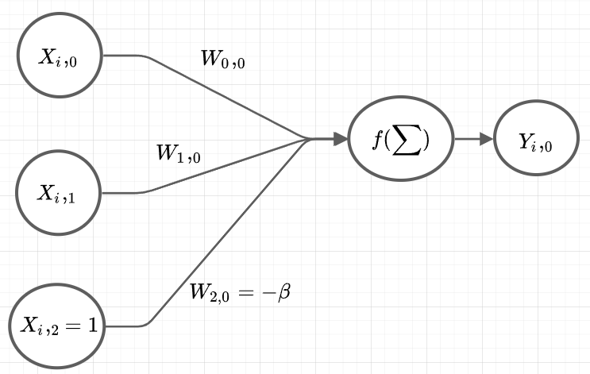

# Adding trainable Bias
```{python 1_0, include=FALSE}
import numpy as np
import matplotlib.pyplot as pyplot
```
The single Perceptron, you saw in the previews chapter had the following activation function:
$$ 
step(s)= 
\begin{cases}
    1,& s	\geq \beta\\
    0,& s < \beta
\end{cases}
$$
with $\beta = 1$ and that is just the right $\beta$ for the given training dataset. But what happens if you shift the training data for example adding $-5$ to the $X$ matrix? Now it will never find the correct answer. That is because you need to select the $\beta$ accordingly. But this wouldnt be intelligent to search for each dataset the optimal $\beta$ by hand. 

## Generalising the Bias
That is why we now generalise the weighted sum step by step. First we generalise the activation function:
$$ 
step(s)= 
\begin{cases}
    1,& s	\geq 0\\
    0,& s < 0
\end{cases}
$$
Now we can list it in the weighted sum:
$$
  step(X \cdot W - \beta) = Y
$$
But we have the same problem as previews, because we need to specify the $\beta$ explicit. To add it to the training process we add a column with ones on the right side of $X$ and add the $-\beta$ to the last row of $W$. The output of one scenario is now caluclated as the following:
$$
  Y_i,_0 = step([X_i,_0 \cdot W_0,_0 + X_i,_1 \cdot W_1,_0 + X_i,_2 \cdot W_2,_0]) = step([X_i,_0 \cdot W_0,_0 + X_i,_1 \cdot W_1,_0 - \beta])
$$
Furthermore because the $W$ is holding the $\beta$, it now gets re-adjusted in the backward pass so it is involved in the training process. Thats why we now generate a random number for it, because it gets corrected anyway.   

Now we have a NN that looks like all the other pictures of a single Perceptron in the internet:  
{ width=50% }<br>   

As python code we did the following:
```{python 1_1, eval=FALSE}
X = np.array([
  [0,0],
  [0,1],
  [1,0],
  [1,1],
])-5
X = np.append(X, np.array([np.ones(len(X))]).T, axis=1)

W = np.array([
  [0.1], 
  [0.2]
])
W = np.append(W, -np.array([np.random.random(len(W[0]))]).T, axis=0)
```
We added $-5$ to the $X$ matrix to simulate the problem of shifted data, added ones on the left side of $X$ and added negative random numbers between $(0,1)$ to the weights. Yes, if you would have a clue, what $\beta$ would be great for the given problem, its better to choose it explicit. The new problem needs more epochs, because it needs to find a good $\beta$ by it self.  

## Appendix (complete code)
The complete code is the following:
```{python 1_2, eval=TRUE}
X = np.array([
  [0,0],
  [0,1],
  [1,0],
  [1,1],
]) - 5
X = np.append(X, np.array([np.ones(len(X))]).T, axis=1)

W = np.array([
  [0.1], 
  [0.2]
])
W = np.append(W, -np.array([np.random.random(len(W[0]))]).T, axis=0)

Y = np.array([
  [0],
  [1],
  [1],
  [1]
])

alpha = 0.01
epochs = 1000

def step(s):
  return( np.where(s >= 0, 1, 0) )


def forward(X, W):
  return( step(X @ W) )

def backward(W, X, Y, alpha, Y_approx):
    return(W + alpha * X.T @ (Y - Y_approx))
  
  
errors = []
for i in range(epochs):
  Y_approx = forward(X, W)
  errors.append(Y - Y_approx)
  W = backward(W, X, Y, alpha, Y_approx)
  
  
  
def mean_square_error(error):
  return( 0.5 * np.sum(error ** 2) )


mean_square_errors = np.array(list(map(mean_square_error, errors)))


def plot_error(errors, title):
  x = list(range(len(errors)))
  y = np.array(errors)
  pyplot.figure(figsize=(6,6))
  pyplot.plot(x, y, "g", linewidth=1)
  pyplot.xlabel("Iterations", fontsize = 16)
  pyplot.ylabel("Mean Square Error", fontsize = 16)
  pyplot.title(title)
  pyplot.ylim(-0.01,max(errors)*1.2)
  pyplot.show()
  
  
plot_error(mean_square_errors, "Single Perceptron with trainable bias")
```


