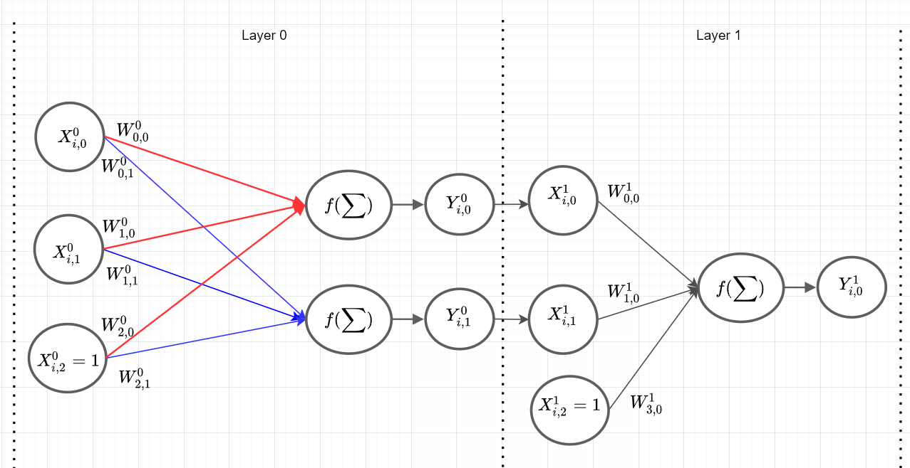

```{python, include=FALSE}
import numpy as np
import random as ra
import pandas as pd
import matplotlib.pyplot as pyplot
pd.set_option('display.max_rows', 500)
pd.set_option('display.max_columns', 500)
pd.set_option('display.width', 1000)
```

# Multi Layer Perceptrons
In a multi layer Perceptron you have multiple layers of neurons. Thats why you need to calculate the forward pass multiple times and the same for the backward pass. First of all, do we need to generalise some definitions, to support this behavior. What we want to do is the NN of the following picture:    
{ width=50% }<br>  
According to the image, the new $W$ is
$$
  W^{\text{layer}}_{\text{input-X, output-Y}}
$$
the new $X$ is
$$
  X^{\text{layer}}_{\text{scenario, value}}
$$
the new $Y$ is
$$
  Y^{\text{layer}}_{\text{scenario, value}}
$$
If you understood the pattern, you can see that we have to create a list with the same $X$, $Y$ and $W$ of the previews chapter for each layer to get the datastructur for a multi layer Perceptron.  
Now we will start with a small example for the XOR-Gate dataset with 2+1 input values, 2+1 hidden neurons and 1 output value like in the image above. With random generated weights ($\beta$ is implicit in the weights and gets adjusted anyway) and the XOR-Gate as dataset, we have the following structur:
```{python}
import numpy as np
import matplotlib.pyplot as pyplot

X = np.array([
  [0,0],
  [0,1],
  [1,0],
  [1,1],
]) 

Y = np.array([
  [0],
  [1],
  [1],
  [0]
])

n_input = len(X[0]) + 1
n_output = len(Y[0])
hidden_layer_neurons = np.array([2]) # the 2 means that there is one hidden layer with 2 neurons

def generate_weights(n_input, n_output, hidden_layer_neurons):
  W = []
  for i in range(len(hidden_layer_neurons)+1):
    if i == 0: # first layer
      W.append(np.random.random((n_input, hidden_layer_neurons[i])))
    elif i == len(hidden_layer_neurons): # last layer
      W.append(np.random.random((hidden_layer_neurons[i-1]+1, n_output)))
    else: # middle layers
      W.append(np.random.random((hidden_layer_neurons[i-1]+1, hidden_layer_neurons[i])))
   
  return(W)

def add_ones_to_input(x):
  return(np.append(x, np.array([np.ones(len(x))]).T, axis=1))

X = add_ones_to_input(X)

W = generate_weights(n_input, n_output, hidden_layer_neurons)

print("W[0]: \n", W[0])
print("W[1]: \n", W[1])
```

<!-- And we are changing the activation function to the sigmoid function: -->
<!-- ```{python} -->
<!-- def sigmoid(s): -->
<!--   return 1.0 / (1.0 + np.exp(-s)) -->
<!-- ``` -->
<!-- and change the activation function in the forward pass: -->
<!-- ```{python} -->
<!-- def forward(X, W): -->
<!--   return( sigmoid(X @ W) ) -->
<!-- ``` -->


Now we can calculate the output value of the NN by evaluating the `forward()` function, adding the ones to the output and evaluating the `forward()` function again. All of this with the according weights:
```{python}
def step(s):
  return( np.where(s >= 0, 1, 0) )

def forward(X, W):
  return( step(X @ W) )

output = forward( add_ones_to_input(forward(X, W[0])), W[1])
print("output: \n", output)
```


```{python}
import numpy as np
import matplotlib.pyplot as pyplot

X = np.array([
  [1,1],
  [0,1],
  [1,0],
  [0,0],
])

Y = np.array([
  [0],
  [1],
  [1],
  [0]
])

n_input = len(X[0]) + 1
n_output = len(Y[0])
hidden_layer_neurons = np.array([2]) # the 2 means that there is one hidden layer with 2 neurons
# example: np.array([6, 2]) would be 2 hidden layers, The first with 6 neurons and the second with 2 (+ there biases)


def generate_weights(n_input, n_output, hidden_layer_neurons):
  W = []
  for i in range(len(hidden_layer_neurons)+1):
    if i == 0: # first layer
      W.append(np.random.random((n_input, hidden_layer_neurons[i])))
    elif i == len(hidden_layer_neurons): # last layer
      W.append(np.random.random((hidden_layer_neurons[i-1]+1, n_output)))
    else: # middle layers
      W.append(np.random.random((hidden_layer_neurons[i-1]+1, hidden_layer_neurons[i])))
  return(W)

def add_ones_to_input(x):
  return(np.append(x, np.array([np.ones(len(x))]).T, axis=1))


W = generate_weights(n_input, n_output, hidden_layer_neurons)


def sigmoid(x):
  return 1.0 / (1.0 + np.exp(-x))

def deriv_sigmoid(x):
  return x * (1 - x)


def forward(x, w):
  return( sigmoid(x @ w) )

def backward(IN, OUT, W, Y, grad, k):
  if k == len(grad)-1:
    grad[k] = deriv_sigmoid(OUT[k]) * (Y-OUT[k])
  else:
    grad[k] = deriv_sigmoid(OUT[k]) *(grad[k+1] @ W[k+1][0:len(W[k+1])-1].T) # ohne das letzte W da wir ja nur die knoten ohen bias befüllen
  return(grad)

eta = 0.03
errors = []
for i in range(40000):
  IN = []
  OUT = []
  grad = [None]*len(W)
  for k in range(len(W)):
    if k==0:
      IN.append(add_ones_to_input(X))
    else:
      IN.append(add_ones_to_input(OUT[k-1]))
    OUT.append(forward(x=IN[k], w=W[k]))
    
  errors.append(Y - OUT[-1])
    
  for k in range(len(W)-1,-1, -1):
    grad = backward(IN, OUT, W, Y, grad, k) 
    
  for k in range(len(W)):
    W[k] = W[k] + eta * (IN[k].T @ grad[k])


def mean_square_error(error):
  return( 0.5 * np.sum(error ** 2) )

mean_square_errors = np.array(list(map(mean_square_error, errors)))

def plot_error(errors, title):
  x = list(range(len(errors)))
  y = np.array(errors)
  pyplot.figure(figsize=(6,6))
  pyplot.plot(x, y, "g", linewidth=1)
  pyplot.xlabel("Iterations", fontsize = 16)
  pyplot.ylabel("Mean Square Error", fontsize = 16)
  pyplot.title(title)
  #pyplot.ylim(-0.01,max(errors)*1.2)
  pyplot.ylim(0,1)
  pyplot.show()
  
plot_error(mean_square_errors, "Mean-Square-Errors of a single Perceptron")

```
