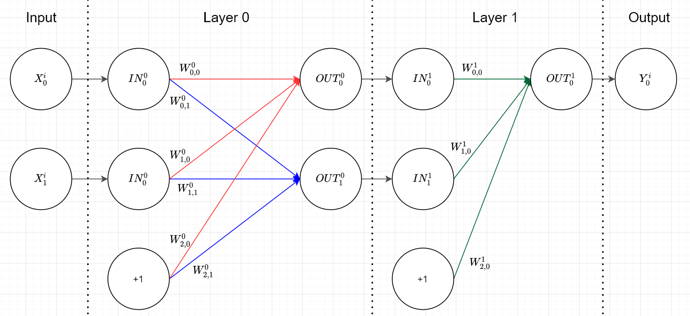

```{python, include=FALSE}
import numpy as np
import matplotlib.pyplot as pyplot
```

# Multi Layer Perceptrons
In a multi layer Perceptron you have multiple layers of neurons. Thats why we need to calculate the forward pass multiple times and the same for the backward pass. First of all, do we need to generalise some definitions, to support this behavior. What we want to do is the NN of the following picture:    
{ width=50% }<br>  

It is my own definition of layers, because i thought, it would be better to display layers like shown in the picture, to take the step from $n$ to $n+1$ hidden layers more easy. You can see that each layer has the same process in the forward pass by evaluating $f(IN^{layer} \cdot W^{layer}) = OUT^{layer}$ and just passing the result to the next layer like $OUT^{layer} = IN^{layer+1}$, with $f$ as the chosen activation function.  
We will choose the sigmoid function as the activation function $f$, because it has an easy deviation $f^`$ for the backward pass and its very close to the behavior of the heavyside function.  
```{python}
def sigmoid(x):
  return 1.0 / (1.0 + np.exp(-x))

def deriv_sigmoid(x):
  return x * (1 - x)
```

Additionaly will we choose the XOR-Gate as training dataset and generate the weights in a very generic approach like the following code shows:
```{python}
X = np.array([
  [0,0],
  [0,1],
  [1,0],
  [1,1],
]) 

Y = np.array([
  [0],
  [1],
  [1],
  [0]
])

n_input = len(X[0]) + 1
n_output = len(Y[0])
hidden_layer_neurons = np.array([2]) # the 2 means that there is one hidden layer with 2 neurons

def generate_weights(n_input, n_output, hidden_layer_neurons):
  W = []
  for i in range(len(hidden_layer_neurons)+1):
    if i == 0: # first layer
      W.append(np.random.random((n_input, hidden_layer_neurons[i])))
    elif i == len(hidden_layer_neurons): # last layer
      W.append(np.random.random((hidden_layer_neurons[i-1]+1, n_output)))
    else: # middle layers
      W.append(np.random.random((hidden_layer_neurons[i-1]+1, hidden_layer_neurons[i])))
   
  return(W)

W = generate_weights(n_input, n_output, hidden_layer_neurons)

print("W[0]: \n", W[0])
print("W[1]: \n", W[1])
```
The input and output layer neurons are calculated from the training dataset and the neurons from the hidden layers are generated with the `hidden_layer_neurons`. For example can we generate two hidden layers with 4 and 2 neurons by `hidden_layer_neurons = np.array([4,2])`. I didnt explicitly choose the bias because it gets corrected anyway.  
Now we need to define a helper function to add the biases, on the last column of the inputs, with:
```{python}
def add_ones_to_input(x):
  return(np.append(x, np.array([np.ones(len(x))]).T, axis=1))
```


## forward pass
The new forward function looks exactly like in the single Perceptron:
```{python}
def forward(x, w):
  return( sigmoid(x @ w) )
```
Now we have everything to calculate the forward pass of the NN from above with the generated weights step by step:
```{python}
IN = []
OUT = []

# layer 0
i = 0
IN.append( add_ones_to_input(X) )
OUT.append( forward(IN[i], W[i]) )

# layer 1
i = 1
IN.append( add_ones_to_input(OUT[i-1]) )
OUT.append( forward(IN[i], W[i]) )

# error
Y-OUT[-1]
```
Thats all! We calculated the forward pass in a very generic way for the NN with 2 input neurons, 2 hidden neurons and 1 output neuron for all 4 scenarios at the same time. Sadly is the forward pass the easiest part of the multi layer Perceptron :)  

## backward pass
We will adjust the weights with the backpropagation algorithm what is a special case of the descent gradient algorithm. In the output layer is it done by calculating the sensitives of the outputs according to the activation function multiplied with the error that occured. On all other layers its calculated by passing backwards the earlier calculated gradient splitted up on each neuron by the previes weights and multiplied by the sensitivity of the outputs of that layer according to the activation function. The formula is the following: 
$$
  grad^i= 
\begin{cases}
    f^`(OUT^i) \cdot (Y-OUT^i),& i =\text{last layer}\\
    f^`(OUT^i) \cdot (grad^{i+1} * \widetilde{W}^{i+1\ T}),& \text{else}
\end{cases}
$$
with $\widetilde{W}$ as the weights of that layer without the connection to the bias neuron, because it has no connection to the previews neurons. In our datastructur its done by removing the last row.  
With the example from above is it done by the following lines of code:
```{python}
grad = [None] * 2

# layer 1
i = 1
grad[i] = deriv_sigmoid(OUT[i]) * (Y-OUT[i])

# layer 0
i = 0
grad[i] = deriv_sigmoid(OUT[i]) *(grad[i+1] @ W[i+1][0:len(W[i+1])-1].T)
```
Now you can look for example at the gradient of the last layer and on the direction it is shown:
```{python}
print("Y: \n",Y)
print("OUT: \n",OUT[1])
print("grad: \n",grad[1])
```
You can see that the gradient shows in the direction that would drift the output $OUT$ closer to the desired output $Y$. That is exactly what the gradient descent algorithm is doing.  
Now do we need to adjust the weights with the gradients and the learningrate $\alpha$ according to the direction of the gradients with the following formula:
$$
  W^i_{new} = W^i_{old} + \alpha \cdot ( IN^{i\ T} * grad^i) 
$$
In the example from above we have the following results for the adjusted weights after the first iteration:
```{python}
alpha = 0.03

W[1] = W[1] + alpha * (IN[1].T @ grad[1]) 
W[0] = W[0] + alpha * (IN[0].T @ grad[0]) 
```


```{python}
import numpy as np
import matplotlib.pyplot as pyplot
numpy.random.seed(0)

X = np.array([
  [1,1],
  [0,1],
  [1,0],
  [0,0],
])

Y = np.array([
  [0],
  [1],
  [1],
  [0]
])

n_input = len(X[0]) + 1
n_output = len(Y[0])
hidden_layer_neurons = np.array([2]) # the 2 means that there is one hidden layer with 2 neurons
# example: np.array([6, 2]) would be 2 hidden layers, The first with 6 neurons (+ there bias) and the second with 2 (+ there bias)


def generate_weights(n_input, n_output, hidden_layer_neurons):
  W = []
  for i in range(len(hidden_layer_neurons)+1):
    if i == 0: # first layer
      W.append(np.random.random((n_input, hidden_layer_neurons[i])))
    elif i == len(hidden_layer_neurons): # last layer
      W.append(np.random.random((hidden_layer_neurons[i-1]+1, n_output)))
    else: # middle layers
      W.append(np.random.random((hidden_layer_neurons[i-1]+1, hidden_layer_neurons[i])))
  return(W)

def add_ones_to_input(x):
  return(np.append(x, np.array([np.ones(len(x))]).T, axis=1))


W = generate_weights(n_input, n_output, hidden_layer_neurons)


def sigmoid(x):
  return 1.0 / (1.0 + np.exp(-x))

def deriv_sigmoid(x):
  return x * (1 - x)


def forward(x, w):
  return( sigmoid(x @ w) )

def backward(IN, OUT, W, Y, grad, k):
  if k == len(grad)-1:
    grad[k] = deriv_sigmoid(OUT[k]) * (Y-OUT[k])
  else:
    grad[k] = deriv_sigmoid(OUT[k]) *(grad[k+1] @ W[k+1][0:len(W[k+1])-1].T) # ohne das letzte W da wir ja nur die knoten ohne bias befüllen
  return(grad)

eta = 0.03
errors = []
for i in range(40000):
  IN = []
  OUT = []
  grad = [None]*len(W)
  for k in range(len(W)):
    if k==0:
      IN.append(add_ones_to_input(X))
    else:
      IN.append(add_ones_to_input(OUT[k-1]))
    OUT.append(forward(x=IN[k], w=W[k]))
    
  errors.append(Y - OUT[-1])
    
  for k in range(len(W)-1,-1, -1):
    grad = backward(IN, OUT, W, Y, grad, k) 
    
  for k in range(len(W)):
    W[k] = W[k] + eta * (IN[k].T @ grad[k])


def mean_square_error(error):
  return( 0.5 * np.sum(error ** 2) )

mean_square_errors = np.array(list(map(mean_square_error, errors)))

def plot_error(errors, title):
  x = list(range(len(errors)))
  y = np.array(errors)
  pyplot.figure(figsize=(6,6))
  pyplot.plot(x, y, "g", linewidth=1)
  pyplot.xlabel("Iterations", fontsize = 16)
  pyplot.ylabel("Mean Square Error", fontsize = 16)
  pyplot.title(title)
  pyplot.ylim(0,1)
  pyplot.show()
  
plot_error(mean_square_errors, "Mean-Square-Errors of MLP 2x2x1")

```


